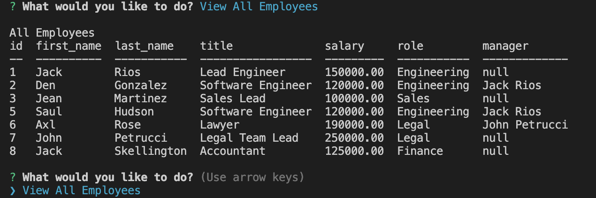

# My Team Tracker 🥸

## Challenge 12
- This is an application for managing the employee database of a company. It was developed using Node.js, Inquirer, and MySQL.

## Installation

- Clone this repository to your local machine with: 
        git clone https://github.com/YOUR_USERNAME/My-Team-Tracker.git
- Navigate to the project directory: 
        cd My-Team-Tracker
- Open your source code editor (VS code)
- Install the dependencies
        npm install
- Configure the database 
    " 
        DB_HOST=''
        DB_NAME='employee_db'
        DB_PASSWORD='XXXXXXXXXX'
        DB_USER='root'
        DB_PORT=''
    "
- Start the index:
    node index.js

## Usage

The application will allow you to perform the following actions:

- View all employees in the database
- Add a new employee to the database
- View all the roles
- View all departments
- Update the information of an existing employee in the database

## User Story
- AS A business owner
- I WANT to be able to view and manage the departments, roles, and employees in my company
- SO THAT I can organize and plan my business

## Acceptance Criteria
- GIVEN a command-line application that accepts user input
- WHEN I start the application
- THEN I am presented with the following options: view all departments, view all roles, view all employees, add a department, add a role, add an employee, and update an employee role
- WHEN I choose to view all departments
- THEN I am presented with a formatted table showing department names and department ids
- WHEN I choose to view all roles
- THEN I am presented with the job title, role id, the department that role belongs to, and the salary for that role
- WHEN I choose to view all employees
- THEN I am presented with a formatted table showing employee data, including employee ids, first names, last names, job titles, departments, salaries, and managers that the employees report to
- WHEN I choose to add a department
- THEN I am prompted to enter the name of the department and that department is added to the database
- WHEN I choose to add a role
- THEN I am prompted to enter the name, salary, and department for the role and that role is added to the database
- WHEN I choose to add an employee
- THEN I am prompted to enter the employee’s first name, last name, role, and manager, and that employee is added to the database
- WHEN I choose to update an employee role
- THEN I am prompted to select an employee to update and their new role and this information is updated in the database

[GitHub/Jeacqueline My Team Tracker](https://github.com/Jeacqueline/My-Team-Tracker)

[Video/ Jeacqueline/ My Super Team](https://drive.google.com/file/d/1-Ic8MAn89WpQZOqunZxXWMNdWwdd1Onv/view)

